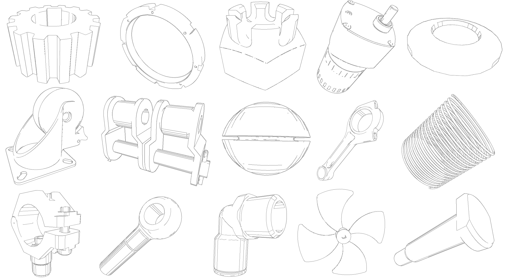
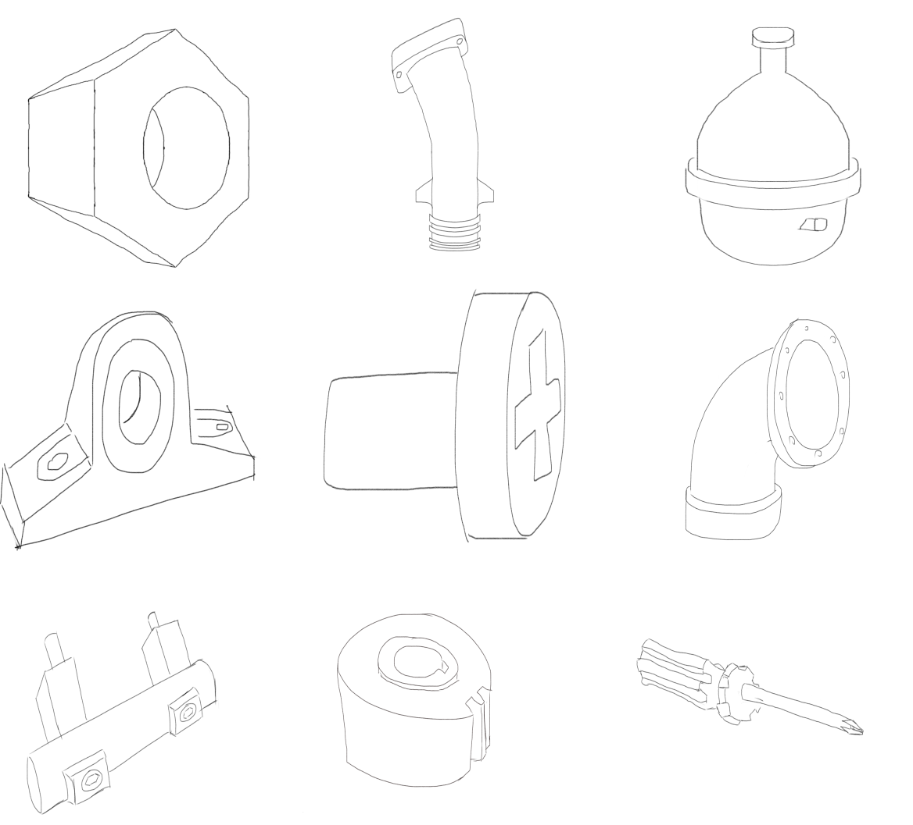
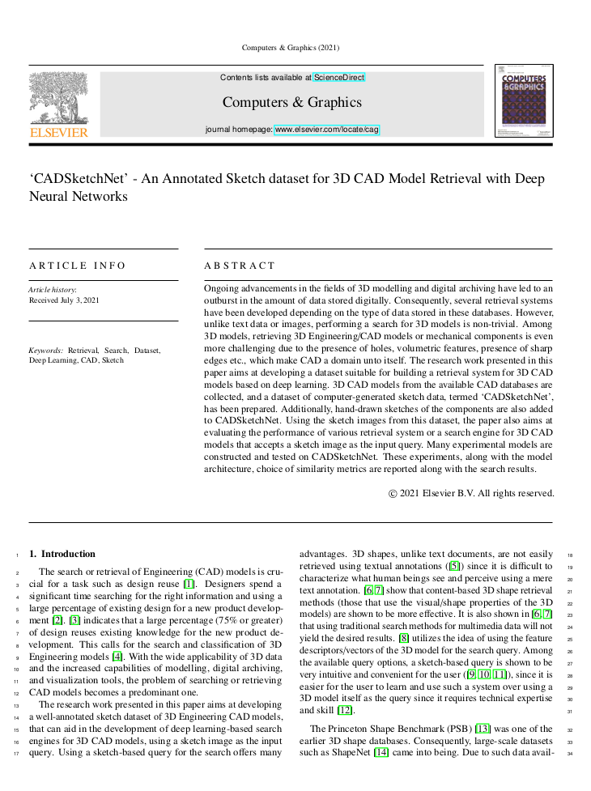

# News
> **(2021, July 03)** The paper is accepted for publicaiton in the Special Section on [3DOR2021 - 14th EG 3D Object Retrieval Workshop](https://3dor2021.github.io/index.html) of the [Computers & Graphics](https://www.journals.elsevier.com/computers-and-graphics) Journal. The early access version of the paper will be made available on this page soon.

> **(2021, July 03)** This is the repository for the 'CADSketchNet' Dataset, associated with the paper <a href="https://ieeexplore.ieee.org/stamp/stamp.jsp?tp=&arnumber=9343314" target="_blank">'CADSketchNet' - An Annotated Sketch dataset for 3D CAD Model Retrieval with Deep Neural Networks</a>. For further details, contact Bharadwaj Manda via [here](https://www.linkedin.com/in/bharadwaj-manda-9730ab114/) or [here](https://bharadwaj-manda.netlify.app/)

## CADSketchNet Dataset

<figure>
  
  <figcaption>Computer Generated Sketches - Dataset_A</figcaption>
</figure>


<figure>
  
  <figcaption>Hand-drawn Sketches - Dataset_B</figcaption>
</figure>


We introduce the CADSketchNet dataset, an annotated collection of sketches of 3D CAD models.
- Dataset-A has 58,696 computer-generated sketches of the 3D CAD models across 68 categories of [MCB](https://mechanical-components.herokuapp.com/)
- Dataset-B has 801 hand-drawn sketches of the 3D CAD models across 42 categories of [ESB](https://engineering.purdue.edu/cdesign/wp/downloads/)

For further details, contact Bharadwaj Manda via [here](https://www.linkedin.com/in/bharadwaj-manda-9730ab114/) or [here](https://bharadwaj-manda.netlify.app/)

## Download

[Download Dataset-A](https://github.com/bharadwaj-manda/CADSketchNet/blob/main/Dataset_A.7z)

[Download Dataset-B](https://github.com/bharadwaj-manda/CADSketchNet/blob/main/Dataset_B.7z)

### Authors

<a href="https://bharadwaj-manda.netlify.app/">Manda, Bharadwaj</a> and <a href="https://www.linkedin.com/in/shubham-dhayarkar-a16a75153/?originalSubdomain=in">Dhayarkar, Shubham</a> and <a href="https://smj007.github.io/">Mitheran, Sai</a> and <a href="https://vkviekash-homepage.github.io/">V.K, Viekash</a> and <a href="https://ed.iitm.ac.in/~raman/">Muthuganapathy, Ramanathan</a>

### Paper/Citation

*Coming soon*

<!--
<a href="https://github.com/bharadwaj-manda/CADSketchNet/blob/gh-pages/CADSketchNet_accepted_version.pdf" target="_blank"></a>

Please cite our paper if you use the CADNET dataset.

```
@ARTICLE{CADSketchNet,  author={Manda, Bharadwaj and Dhayarkar, Shubham and Mitheran, Sai and V.K, Viekash. and Muthuganapathy, Ramanathan},  journal={Computers & Graphics}, title={'CADSketchNet' - An Annotated Sketch dataset for 3D CAD Model Retrieval with Deep Neural Networks},   year={2021},  volume={},  number={},  pages={},  doi={}}
```
-->

### Acknowledgements

We are grateful to the teams of ESB and MCB for making their datasets available. Thanks are also due to the many members who have contributed to the CADSketch dataset.

### License

This dataset is licensed under CC BY-NC-SA: Creative Commons Attribution-NonCommercial-ShareAlike 4.0 International This license is one of the Creative Commons licenses and allows users to share the dataset only if they (1) give credit to the copyright holder, (2) do not use the dataset for any commercial purposes, and (3) distribute any additions, transformations or changes to the dataset under this same license.

